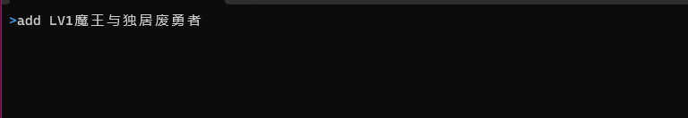
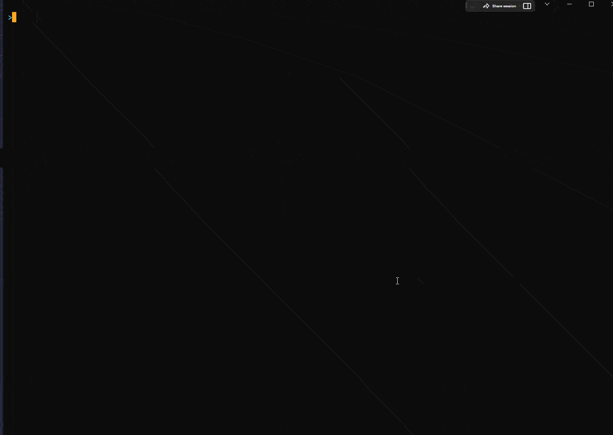

# AniCat

<p align="center">
    
</p>

通过命令行交互的一键追番工具

[](https://goreportcard.com/report/github.com/NullpointerW/anicat) [](https://tip.golang.org/doc/go1.20)
## 功能
 * 傻瓜式: 无需配置任何网站的账号或者rss订阅，只需输入番剧名即可一键订阅
 * 支持下载后的剧集自动重命名，方便媒体软件进行刮削 e.g:
  ```
  [UHA-WINGS]Bocchi the Rock![05][x264][1080p]>>孤独摇滚！S01E05
  ```
 * 支持字幕组筛选、关键字正则过滤
 * 下载完成后提醒推送(目前支持邮件)
 
 ## 部署
 ### linux 
 推荐使用 docker-compose 部署
 * 创建应用目录
``` bash
mkdir -p /usr/opt/anicat && cd /usr/opt/anicat
   ```
 * 下载配置文件并修改
``` bash
mkdir cfg && wget -P ./cfg/ https://raw.githubusercontent.com/NullpointerW/AniCat/master/env.yaml && vim ./cfg/env.yaml
   ```
   <span id="cfg_jmp"></span>  
 * 修改配置文件
```yaml
port: 8080 # 监听端口 docker-compose部署无需更改
path: /bangumi # 番剧下载路径 docker-compose部署无需更改
drop-dumplicate: on # 若存在相同集数，则删除重复项（建议开启)
qbittorrent:
  url: http://qb:8989 # qbt-api url,在docker-compose部署时无需更改
  username: admin
  password: adminadmin
# localed: yes # 如果qbt开启了本地登录选项，则可不用填写用户,名和密码，docker-compose部署则可忽视此项
  timeout: 3500 # qbt-api请求的超时时间，有时任务添加到qbt上，调用api后无法立即响应到数据
  proxy: # qbt代理配置 可选项
    address: remote:7890 # 配置qbt的代理地址
    type: http # 类型可为 http,socks5等 详见qbt wiki
    host-lookup: on # 使用代理查询域名
    peer: on # 使用代理进行对端连接(文件传输)

crawl: # 为爬虫设置代理，可省略
  proxies: # 可设置多个代理进行轮询
    - http://remote:7890
    - http://remote:7891
    - http://remote1:7890

push: # 配置推送服务，如无此需求则可省略
  email:
    host: smtp.xxx.com # SMTP 
    port: 25
    username: xxx@xxx.com # 发件邮箱
    password: xxx
  # skipssl: yes # 跳过ssl,开启此项可能需要变更相应的smtp地址，具体情况询问邮箱运营商
  # template: tmp/template.html # 邮件模板地址，若省略则使用内置的模板
```
  
 * 下载docker-compose yaml
``` bash 
wget https://raw.githubusercontent.com/NullpointerW/AniCat/master/Docker/docker-compose.yml
   ```

``` yaml
version: "3.9"
services:

  anicat:
    image: wmooon/anicat:latest
    container_name: anicat
    ports:
      - 8080:8080 # anicat监听端口
  # environment:
    # - DEBUG=true # 开启debug模式
    depends_on:
      - qb
    user: "1000:1000"
    volumes:
      - ./cfg/env.yaml:/opt/env.yaml # 配置文件路径
      - ./bangumi:/bangumi # 番剧下载路径，如果改动则需要和qb保持一致
    restart: unless-stopped
 
  qb:
    image: superng6/qbittorrentee:latest
    container_name: qb
    ports:
      - 8989:8989 # webui 端口
    environment:
      - PUID=1000
      - PGID=1000
      - TZ=Asia/Shanghai
      - WEBUIPORT=8989 
    volumes:
      - ./qb:/config
      - ./bangumi:/bangumi
    restart: unless-stopped

 ```
 * 运行
``` bash 
docker compose up -d
   ```

### windows
 * [下载qbittorrent](https://www.qbittorrent.org/download.php)（版本≥ v4.1）并安装
 * [下载可执行文件](https://github.com/NullpointerW/AniCat/releases)和[配置文件](#cfg_jmp)到任意文件夹下,修改后运行
 ``` shell
 PS D:\anicatv0.0.2b> .\anicat-windows-amd64.exe -d -e=./cfg/env.yaml
 -d 开启debug模式
 -e 设置配置文件路径,默认为./env.yaml
  ```

## 使用命令
 ### 订阅
 使用`add`命令订阅番剧,成功后返回sid
 ``` bash
add LV1魔王与独居废勇者
 ```
 
 可选择字幕组和通过正则筛选剧集
 ```bash
add 孤独摇滚 -g 千夏字幕组 --rg --mc 简体 --mn \s?0[1-5]|1[0-1]
 -g,--group 选择字幕组
 --rg       使用正则
 --mc       包含
 --mn       排除
 ```
选择千夏字幕组,排除1-5，10-11集，字幕语言为简体中文
 ### 退订
 使用`rm`命令退订番剧
 ``` bash
rm 376106 
 通过番剧的sid来删除
 sid与它在bgmiTV上的subjectID一致
 可通过`ls`命令查看sid
 ```
 ### 浏览资源列表
使用`lsi`命令浏览该番剧的资源列表
 ``` bash
lsi 孤独摇滚
 ```
 
 如果要浏览的番剧资源没有rss组或者在2013年之前（Mikan Project的rss资源组从2013年开始收录），则`lsi`将会展示种子搜索列表
 在使用`add`添加该番剧时可用-i,--index参数指定下载资源的列表索引
``` bash
lsi 龙与虎
```
 
 在lsi 命令末尾添加-s参数,可优先展示搜索列表，列如`lsi 孤独摇滚 -s`
 ### 查看已订阅列表
 使用`ls`查看所有已订阅番剧的具体信息
 ``` bash
ls
 ```
 ### 查看文件的下载状态
 使用`stat`通过sid查看该番剧的下载状态
  ``` bash
stat 376106
 ```