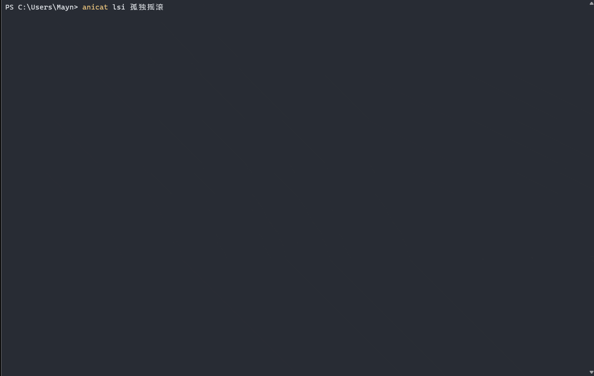
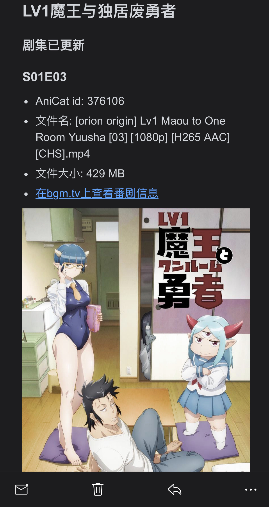

# AniCat

<p align="center">
    
</p>

通过命令行交互的一键追番工具

[](https://goreportcard.com/report/github.com/NullpointerW/anicat) [](https://tip.golang.org/doc/go1.21) [](https://github.com/NullpointerW/AniCat/releases/tag/v0.0.2b
)
## 功能
 * 傻瓜式: 无需配置任何网站的账号或者rss订阅，只需输入番剧名即可一键订阅
 * 支持下载后的剧集自动重命名，方便媒体软件进行刮削 e.g:
  ```
  [UHA-WINGS]Bocchi the Rock![05][x264][1080p]>>孤独摇滚！S01E05
  ```
 * 支持字幕组筛选、关键字正则过滤
 * 下载完成后提醒推送(目前支持邮件)
 
 ## 部署
 ### linux 
 推荐使用 docker-compose 部署
 * 创建应用目录
``` bash
mkdir -p /usr/opt/anicat && cd /usr/opt/anicat
   ```
 * 下载配置文件并修改
``` bash
mkdir cfg && wget -P ./cfg/ https://raw.githubusercontent.com/NullpointerW/AniCat/master/env.yaml && vim ./cfg/env.yaml
   ```
   <span id="cfg_jmp"></span>  
 * 修改配置文件
```yaml
port: 8080 # 监听端口 docker-compose部署无需更改
path: /bangumi # 番剧下载路径 docker-compose部署无需更改
drop-duplicate: on # 若存在相同集数，则删除重复项（建议开启)
qbittorrent:
  url: http://qb:8989 # qbt-api url,在docker-compose部署时无需更改
  username: admin
  password: adminadmin
# localed: yes # 如果qbt开启了本地登录选项，则可不用填写用户,名和密码，docker-compose部署则可忽视此项
  timeout: 3500 # qbt-api请求的超时时间，有时任务添加到qbt上，调用api后无法立即响应到数据
  proxy: # qbt代理配置 可选项
    address: remote:7890 # 配置qbt的代理地址
    type: http # 类型可为 http,socks5等 详见qbt wiki
    host-lookup: on # 使用代理查询域名
    peer: on # 使用代理进行对端连接(文件传输)

crawl: # 为爬虫设置代理，可省略
  proxies: # 可设置多个代理进行轮询
    - http://remote:7890
    - http://remote:7891
    - http://remote1:7890

push: # 配置推送服务，如无此需求则可省略
  email:
    host: smtp.xxx.com # SMTP 
    port: 25
    username: xxx@xxx.com # 发件邮箱
    password: xxx
  # skipssl: yes # 跳过ssl,开启此项可能需要变更相应的smtp地址，具体情况询问邮箱运营商
  # template: tmp/template.html # 邮件模板地址，若省略则使用内置的模板
```
#### docker-compose 部署
 * 下载docker-compose yaml
``` bash 
wget https://raw.githubusercontent.com/NullpointerW/AniCat/master/Docker/docker-compose.yml
   ```

``` yaml
version: "3.9"
services:

  anicat:
    image: wmooon/anicat:latest
    container_name: anicat
    ports:
      - 8080:8080 # anicat监听端口
  # environment:
    # - DEBUG=true # 开启debug模式
    depends_on:
      - qb
    user: "1000:1000"
    volumes:
      - ./cfg/env.yaml:/opt/env.yaml # 配置文件路径
      - ./bangumi:/bangumi # 番剧下载路径，如果改动则需要和qb保持一致
    restart: unless-stopped
 
  qb:
    image: superng6/qbittorrentee:latest
    container_name: qb
    ports:
      - 8989:8989 # webui 端口
    environment:
      - PUID=1000
      - PGID=1000
      - TZ=Asia/Shanghai
      - WEBUIPORT=8989 
    volumes:
      - ./qb:/config
      - ./bangumi:/bangumi
    restart: unless-stopped

 ```
 * 运行
``` bash 
docker compose up -d
   ```

#### docker run 部署
 ``` bash 
docker network create anicat-net \
docker run -d --name=qb -p ${qbt_webui_port}:8989 \
 -e PUID=1000 -e PGID=1000 -e TZ=Asia/Shanghai -e WEBUIPORT=8989 \
 -v ${qbt_config}:/config -v ${usr_bgmi_path}:/bangumi\
 --restart unless-stopped \
 --network anicat-net --network-alias qb \
 superng6/qbittorrentee:latest ; \
docker run -d --name=anicat --restart unless-stopped \
 -v ${usr_bgmi_path}:/bangumi  -v ${anicat_cfg}:/opt/env.yaml \
 -p ${anicat_port}:8080  --user 1000:1000 \
 --network anicat-net --network-alias anicat \
 wmooon/anicat:latest 
   ```
* 或者使用[shell脚本](docker/docker_run.sh) 
``` bash 
./docker_run.sh <qbt_webui_port> <qbt_config> <usr_bgmi_path> <anicat_port> <anicat_cfg>
   ```

### windows
 * [下载qbittorrent](https://www.qbittorrent.org/download.php)（版本≥ v4.1）并安装
 * 开启qbittorrent的webui
 * [下载可执行文件](https://github.com/NullpointerW/AniCat/releases)和[配置文件](#cfg_jmp)到任意文件夹下,修改后运行
 ``` shell
 PS D:\anicatv0.0.2b> .\anicat-windows-amd64.exe -d -e=./cfg/env.yaml
 -d 开启debug模式
 -e 设置配置文件路径,默认为./env.yaml
  ```
### 服务方式运行
[下载anicat-service](https://github.com/NullpointerW/AniCat/releases/download/v0.0.3b/anicat-service-windows-service-amd64.exe)
* 安装服务
 ``` shell
 PS D:\anicatv0.0.3b> .\anicat-windows-service-amd64.exe install
  ```
* 卸载服务
 ``` shell
 PS D:\anicatv0.0.3b> .\anicat-windows-service-amd64.exe uninstall
  ```
* 启动服务
 ``` shell
 PS D:\anicatv0.0.3b> .\anicat-windows-service-amd64.exe start
  ```
 ## 客户端
* [下载客户端`anicat-{platform}-cli`](https://github.com/NullpointerW/AniCat/releases)
* 运行
``` bash
 ./anicat-linux-cli-amd64 -h anicat-host.com -p 1006
 -h 主机名
 -p 端口号
 ```
   默认连接地址为localhost:8080
## 命令/使用
 ### 订阅
 使用`add`命令订阅番剧,成功后返回sid
 ``` bash
add LV1魔王与独居废勇者
 ```
 \
 可选择字幕组和通过正则筛选剧集
 ```bash
add 孤独摇滚 -g 千夏字幕组 --rg --mc 简体 --mn \s?0[1-5]|1[0-1]
 -g,--group 选择字幕组
 --rg       使用正则
 --mc       包含
 --mn       排除
 ```
选择`千夏字幕组`,排除`1-5`，`10-11`集，语言为`简体中文`
 ### rss feed 订阅
 ```bash
add --feed https://mikanani.me/RSS/Bangumi?bangumiId=2549&subgroupid=552 --name xxx
 通过rss url进行订阅，如未指定名称则尝试从rss中解析
 ```
 ### 退订
 使用`rm`命令退订番剧
 ``` bash
rm 376106 
 通过番剧的sid来删除
 sid与它在bgmiTV上的subjectID一致
 可通过`ls`命令查看sid
 ```
 ### 浏览资源列表
使用`lsi`命令浏览该番剧的资源列表
 ``` bash
lsi 孤独摇滚
 ```
 
#### 老番资源列表
 如果要浏览的番剧资源没有rss组，或者在2013年之前（Mikan Project的rss资源组从2013年开始收录），则`lsi`将会展示种子搜索列表\
 在使用`add`添加该番剧时可用`-i`,`--index`参数指定下载资源的列表索引
``` bash
lsi 龙与虎
 ```
 
 在lsi 命令末尾添加-s参数,可优先展示搜索列表，列如`lsi 孤独摇滚 -s`
 ### 查看已订阅列表
 使用`ls`查看所有已订阅番剧的具体信息
 ``` bash
ls
 ```
 ### 查看文件的下载状态
 使用`stat`通过sid查看该番剧的下载状态
  ``` bash
stat 376106
 ```
 ### 全局过滤词
 在env.yaml中配置全局过滤词:
```yaml
rss-filter:
  contain: #包含
    - chs,简体中文,简中,简 #同一组的过滤词用','分割,它们之间为或关系
    - 1080p,1080x1920,1080 #不同组之间的关系为与，必须匹配到两组中的任意过滤词
  exclusion: #排除
    - 外挂,外掛
```
 ### 邮件提醒
 如果要使用提醒功能，请配置stmp服务器信息\
 内置模板的如下：\
 
 <!---->

### 在媒体库上打开
 通过infuse、Plex、Jellyfin 打开番剧下载目录进行自动刮削并观看:\
 
 

 注: 有多个季的番剧将会在同一文件夹下，（文件夹命名规则和TMDB一致）例如：\
 
<!-- 
 -->

 ## 说明
 ### 数据源
   资源\
       [Mikan Project](https://mikanani.me/)\
   信息采集\
       [Bangumi 番组计划](https://bgm.tv/)\
       [TMDB](https://www.themoviedb.org/)\
   海报封面刮削\
       [Bangumi 番组计划](https://bgm.tv/)\
       [豆瓣](https://www.douban.com/)
 ### 常见问题
  *Q1*: &nbsp;为什么订阅总是失败并返回**EOF**或者**wsarecv: An existing connection was forcibly closed by the remote host**之类的网络错误? \
  *A1*: &nbsp;如果在国内环境，因为GFW的关系，访问Mikan，TMDB可能会受阻，建议开启代理; \
   如果启用代理后仍然频繁失败，则有可能是当前ip访问频率过高，触发了服务器的流量限制/反爬策略，建议过一会再进行尝试订阅，或者为爬虫设置多个代理节点。  

     
  *Q2*: &nbsp;为什么有时候订阅番剧要等待这么长时间？\
  *A2*: &nbsp;`add`命令的执行时间受多个方面的因素影响(GFW干扰  代理节点故障 本地网络阻塞 服务器负载过高 等诸多因素），快则2-3秒，慢则几十秒都是有可能的。

 ## 交流
 目前该项目还处于测试阶段，欢迎各位使用并提交问题以及改进点和新功能，如使用中有任何问题，请提交issues或者邮件联系我，email: voidmanwzp@gmail.com
